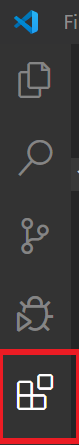
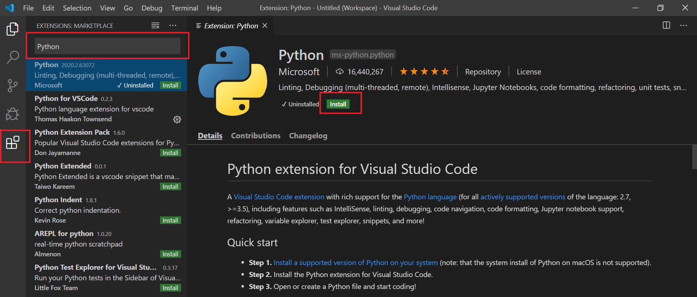
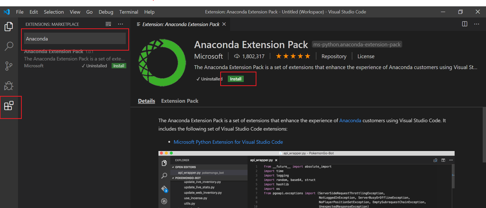
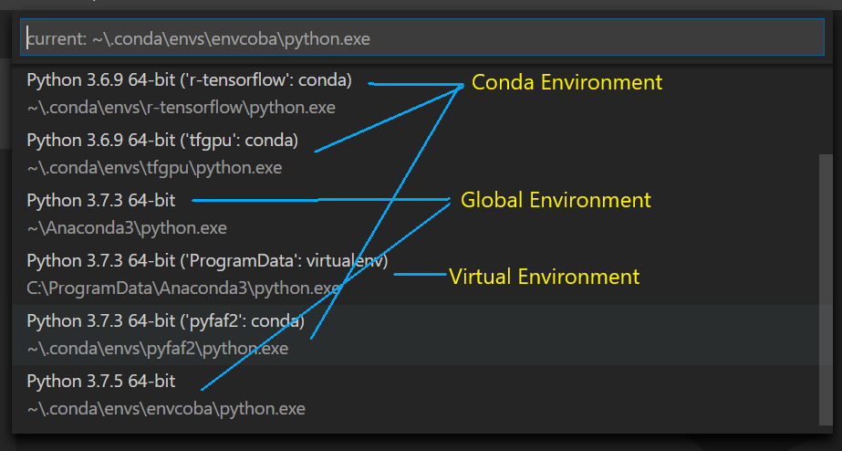
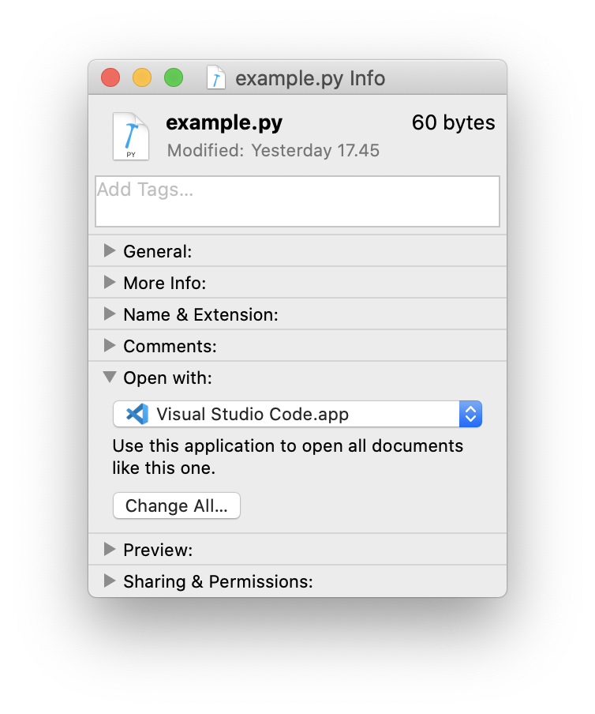
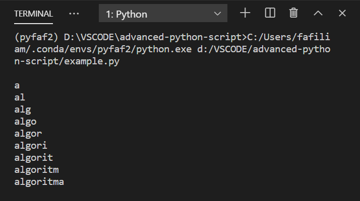

# Visual Studio Code Guide
## What is Visual Studio Code?

As a developer, we need a code editor to help us run the code script. Code editor is one of the most important parts of our setup. Visual Studio Code (VS Code) is a free code editor which runs on the macOS, Linux and Windows operating systems. It comes with built-in support for JavaScript, TypeScript and Node.js and has a rich ecosystem of extensions for other languages (such as C++, C#, Java, Python, PHP, Go) and runtimes (such as .NET and Unity).

## VS Code Installation

VS Code can runs on the macOS, Linux and Windows operating systems. Based on its [official page](https://code.visualstudio.com/docs/setup/setup-overview), please follow this step to install VS Code on your machine:

### Windows
- Download the [Visual Studio Code](https://code.visualstudio.com/docs?dv=win) installer for Windows.
- Run the installer (VSCodeUserSetup-{version}.exe). This will only take a minute.
- By default, VS Code is installed under C:\users\{username}\AppData\Local\Programs\Microsoft VS Code.

> Note: .NET Framework 4.5.2 or higher is required for VS Code. If you are using Windows 7, make sure you have at least .NET Framework 4.5.2 installed.

### MAC OS
- Download [Visual Studio Code](https://code.visualstudio.com/docs?dv=osx) for macOS.
- Double-click on the downloaded archive to expand the contents.
- Drag Visual Studio Code.app to the Applications folder, making it available in the Launchpad.
- Add VS Code to your Dock by right-clicking on the icon to bring up the context menu and choosing Options, Keep in Dock.

### Linux
You can do the installation method below if the Linux distribution is Debian or Ubuntu.
- Download and install the [.deb package (64-bit)](https://code.visualstudio.com/docs/?dv=linux64_deb), either through the graphical software center if it's available, or through the command line with:

```
sudo apt install ./<file>.deb

# If you're on an older Linux distribution, you will need to run this instead:
# sudo dpkg -i <file>.deb
# sudo apt-get install -f # Install dependencies
```

If you want install manually without download .deb file before, you can follow this script:

```
curl https://packages.microsoft.com/keys/microsoft.asc | gpg --dearmor > packages.microsoft.gpg
sudo install -o root -g root -m 644 packages.microsoft.gpg /usr/share/keyrings/
sudo sh -c 'echo "deb [arch=amd64 signed-by=/usr/share/keyrings/packages.microsoft.gpg] https://packages.microsoft.com/repos/vscode stable main" > /etc/apt/sources.list.d/vscode.list'
```
Then update the package cache and install the package using:
```
sudo apt-get install apt-transport-https
sudo apt-get update
sudo apt-get install code # or code-insiders
```

## Extension
Lots of features provided by Visual Studio Code including Intellisense, Git Integration, Debugging, and extension features that add text editor capabilities. VS Code can be used directly without extensions as long as the programming flow is supported directly. But there are some programming paths that are not supported directly. Here we need the extension because it can add the ability to support the desired programming flow. VS Code Extensions are mostly made by third-party developers who are also contributors of VS Code. Extensions for VS Code can be seen in [Market Extensions](https://marketplace.visualstudio.com/VSCode). If you have installed VS Code on your computer, you can find various extensions provided by VS Code in the Extensions menu or you can find it with a shortcut `Ctrl+Shift+X`.


### Install an Extension

To be able to use extensions on VS Code, we need to install an extension that suits our needs. At this time, we need to install 2 extensions, Python and Anaconda.

#### Python

Python extension is needed because it has full support for the Python programming language including features in it that will help us later. If you want to install Python extension, you can follow this steps below:
- Go to Extensions menu or use shortcuts `Ctrl+Shif+X`
- In the search box extensions, type Python. After that, several extensions will appear in VS Code. Select `Python` and VS Code will display python extension details.
- To install this extension, please click `Install` button next to the python icon image.


#### Anaconda

The Python for Visual Studio Code extension allows VSC to connect to Python distributions installed on your computer. If you’ve installed Anaconda as your default Python installation and installed Python for Visual Studio Code, your VSC installation is already set to use Anaconda’s Python interpreter. If you want to install Anaconda extension, you can follow this steps below:
- Go to Extensions menu or use shortcuts `Ctrl+Shif+X`
- In the search box extensions, type Anaconda. Select `Anaconda` and VS Code will display Anaconda extension details.
- To install this extension, please click `Install` button next to the Anaconda icon image.


## Working with Python Script

>**Important Notes**: 
>Please note that this guide assume you to already installed python environment. If you haven't installed it yet,
please follow [this_guide](google.com)

### Setting up Environment

Before running a python script on VS Code, it would be nice if we setting up the environment fist. You can use
shortcut `Ctrl+Shift+P` on windows or `Command+Shift+P` on Mac to open the Command Palette. On the Command Palette type `Python: Select Interpreter` and select it. 


The Python: Select Interpreter command displays a list of available global environments, conda environments, and virtual environments. Please choose the one that suits your needs (select the environment that you created before and have installed several packages needed to work on the project). This example uses a conda environment called pyfaf2 and uses python version 3.7.3. You can change the interpreter at any time according to the needs of the project being worked on.



At the bottom you can see a status bar that shows the active interpreter that is being used. 


Now we are ready to work with python script. We will try to use our terminal (or in Windows, make sure to use `command prompt`)

### 1. Make new directory
It is recomended that we use a separate directory for each project. In this example, we will make one called `python_exercise`. 

<details><summary>using terminal</summary>

Open your terminal, create new directory and enter it
```bash
mkdir python_excercise
cd python_excercise
```
</details>

<details><summary>using file explorer</summary>
Using your file explorer, crete new directory and enter it. 
</details>

### 2. Create and edit python file 

```bash
touch example.py
open example.py
```
when doing `open exaple.py`, you're opening a python file using current default software. I recommend you to set the default software as `Visual Studio Code` since we are going to deal with it alot. 

**(Optional) Changing the default file opener**

<details><summary>Mac</summary>

Using your `Finder` :
- Right click on your .py file 
- Select 'Get Info'
- Open 'Open with' dropdown menu
- Select `Visual Studio Code`


</details>

<details><summary>Windows</summary>

Using your `File Explorer`:
- Right click on you .py file 
- Select 'Open WIth'
- Select 'Choose Another App', find `Visual Studio Code` and check it. Check also the 'Always use this app to open `.py` file'
<!-- Todo: Kasih gambar  -->
</details>

<details><summary>Linux</summary>
<!-- Todo: 
- Kasih instruksi 
- Kasih gambar
 -->
</details>

**Edit python file**

After opening the `.py` file, you can edit it whatever you want. For the sake of easiness, let's try with something simple like this: 
```python 
text = 'algoritma'
for i in range(10):
    print(text[:i])
```
Copy-paste code above into your `example.py`, and hit `save`. Now your python script is ready to run. 


### 3. Run python file
Open your terminal, change directory to where your `example.py` file located. If your path is too long to type, you can 
copy-paste it to your terminal. Here's a quick view of how you can do it.

<details><summary>Windows</summary>
It's simple way to run `example.py` with Python. Just click the Run Python File in Terminal play button in the top-right side of the editor.
    


The button opens a terminal panel in which your Python interpreter is automatically activated, then runs python `example.py`:



There are other ways to run Python within VS Code. Yo can right-click anywhere in the editor window and select Run Python File in Terminal or select one or more lines, then press `Shift+Enter` or right-click and select Run Selection/Line in Python Terminal.

</details>

<details><summary>Mac</summary>
    
- On your `Finder`, right click on your `python_exercise` folder
- Hover onto `Copy "python_exercise"` (Don't click)
- hold `option` button to see the `Copy "python_exercise" as pathname`, and click it. You will now have the pathname ino your clipboard. 
- Open your terminal, write `cd <command + v>`. You should now moved into designated directory.
- type`python example.py`and hit enter.
</details>

<details><summary>Linux</summary>
 
</details>

# Advanced Python Script
*Please note that this section needs a basic competency of python*


## Function or Method
In python function and method are basically the same thing. What makes it differs is a method belongs to an object while function can be freely made and unattached into a specific object. 

When I said `Object`, it refers to `Class` in Object Oriented Programming. An `Object` is a manifestation of `Class`. Let's not talk this further. 

You can make a function called `tambah` by doing this thing
```python 
def tambah(a,b):
    return a+b
```

and to run in simply call `tambah(x,y)` where x and y is any data type (could be int, float, list, array) that support addition operation. 

On the other hand, you can make a method but first you have to define the `Class` too 
```python
Class Matematika:
    def tambah(a,b):
    return a+a+b+b
```

and to call it, you should create the instance of `Matematika` first. 

```python 
mat = Matematika()
mat.tambah(a,b)
```

Now, are you familiar with it ? don't be confused with `Object Oriented Programming`, for we won't do that much. 

## Module
Imagine if you are going to make a tons of functions. Will you do that in one `.py` file? NO. We should have a file that saves the functions. 

On its best practice, we write very specific functions in one `.py` file. Then we grouped the similar `.py` files into one directory. 

A `module`, is how we call the `.py` file containing functions, separated from our main `.py` file. 

If you still confused, let's try it out. Create file named `OperasiDasar.py` and edit it into the following: 
```python 
def tambah(a,b):
    return (a+b) 

def kurang(a,b):
    return (a-b)

def kali(a,b):
    return (a*b)

def bagi(a,b):
    return (a/b)
```

after that, create new `main.py` or `main.ipynb` (depends what you like) and if you write this correctly, the return should be `3`. 

```python
>>> import OperasiDasar as od
>>> od.tambah(1,2)
3
```
## Package
Package is a set of modules grouped into one directory. 

To make a package, simply create new directory called `kalkulus`.
Copy `OperasiDasar.py` file inside it, and create new `.py` files called `OpeariLanjut.py`. Fill these code into `OperasiLanjut.py`

```python 
def faktorial(a):
    if a>= 0 :
        if a <= 1 :
            return 1
        else:
            return (a* faktorial(a-1))

def jumlah(a):
    res = 0
    if a>= 0:
        for i in range (1,a+1):
            res += i 
    return res 
```

Now, on your previous `main.py` or `main.ipynb` file, import the modules. Please note that we are importing a module, so type it correctly what module you wanted to import inside a specific package. These are several way you can import them.
```python 
import kalkulus.OperasiDasar as klod 
import kalkulus.OperasiLanjut as klol
```
or 
```python 
from kalkulus import OperasiDasar as klod
from kalkulus import OperasiLanjut as klol
```
or 
```python 
from kalkulus import OperasiDasar as klod, OperasiLanjut as klol
```

I prefer the last one. 

Now let's wrap it up. Copy these code into your `main.py` file or `main.ipynb` file and see the results
```python
from kalkulus import OperasiDasar as klod, OperasiLanjut as klol

faktor1 = 13
faktor2 = 37

nilai1 = klod.kali(faktor1, faktor2)
nilai2 = klol.faktorial(nilai1)

print(f"Hasil kali: {nilai1}")
print(f"Haisl faktorial kali: {nilai2}")
```
Basically it will print the result of `481!` wich resulting in a value **over 1000** digit. How would you do that in different programming language? 

__
*Love, Python*

